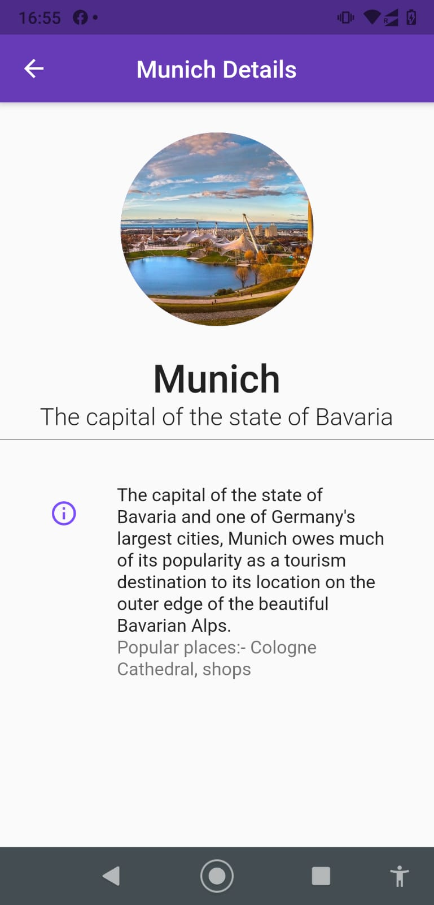

# local json_data to flutter app

A flutter app in which we can fetch the data from local json.
In the home page only the name and short description. Once the user will click any of the displayed list on home page it will display the details of the perticular object. 

## Screenshots

|                       |                              |                              |                              
|-----------------------| ---------------------------- | ---------------------------- | 
|  |  |
